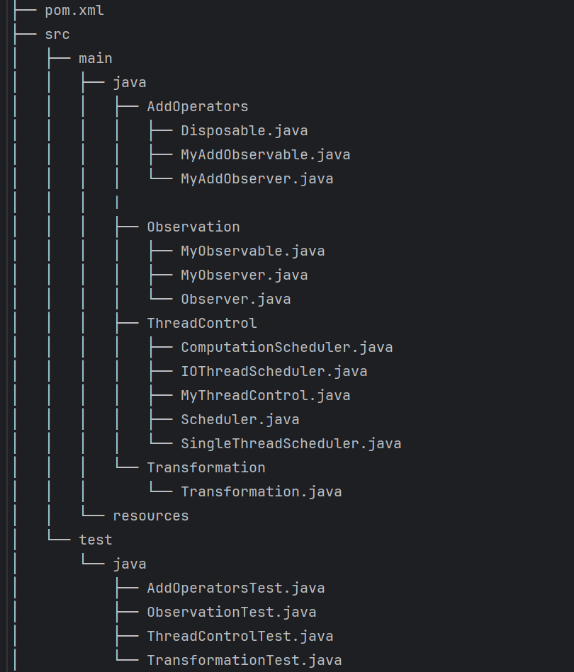

Отчет:
1) Мною была реализована собственная версия библиотеки RxJava, используя основные концепции реактивного программирования. 
Проект включает в себя базовые компоненты реактивного потока, поддерживает асинхронное выполнение, обработывает ошибки
и предоставлять операторы преобразования данных.

2) Архитектура проекта:

В папке main/java находятся главные пакеты библиотеки, согласно поставленынм заданиям:
- Базовые компоненты (Observation);
- Операторы преобразования данных (Transformation);
- Управление потоками выполнения (ThreadControl);
- Дополнительные операторы и управление подписками (AddOperators).

На каждый такой пакен написаны тесты и сохранены в папке test.

3) Scheduler это мощный механизм RxJava, который упрощает и улучшает работу с асинхронностью, 
делая приложения более отзывчивыми, производительными и легко поддерживаемыми. Scheduler позволяет переносить выполнение 
Observable в другие потоки. Это критически важно для разгрузки основного потока пользовательского интерфейса (UI) от 
длительных операций, таких как сетевые запросы, обработка изображений или 
большие объемы вычислений. 
- Schedulers.io(): Для работы с сетью, файлами, базами данных (ввод-вывод). Создает пул потоков для ожидания.
- Schedulers.computation(): Используется для вычислений, обработка данных. Пул потоков = количество ядер процессора.
- Schedulers.single(): Использует один поток. Для последовательного выполнения задач.

4) Основные сценарии тестирования:
- ObservationTest - создание наблюдателей и проверка соответствия ожидаемый сообщений с полученными наблюдателями.
- TransformationTest - скармливаем объекту цифры, которые он приобразует в Текст, в другом тесте отправялем цифры - 
обратно получаем нечетные цифры в виде текста, в последнем тесте фильтруем цифры свыше 5.
- ThreadControlTest - создаем три типа Шедулеров (IO, Computation, Single), каждый создается в потоках, согласно описанной
логике выше, после запуска всех методов проверяем ожидаемую надпись, отправленную в объект при создании.
- AddOperatorsTest -  я создал отдельный пакет расширяющий пакет Observation. Понимаю, что в продуктиве - это моветон, 
- но на этот шаг шел только в качестве разделения Задания и его выполенения. В реальной жизни я бы создал одну библиотеку 
- или расширял бы старую... Данный класс тестирует перобразование старого Observation в новый (создает копию), сохраняя 
- данные старого объекта. Провел тест отписки наблюдателя и провел тест обработки ошибок, по Throwable, переданному 
через метод onError().

5) Реализованная библиотека предоставляет возможности для преобразования, фильтрации, комбинирования и управления 
потоками данных. Область применения описывалась выше в пунктах 3 и 4.